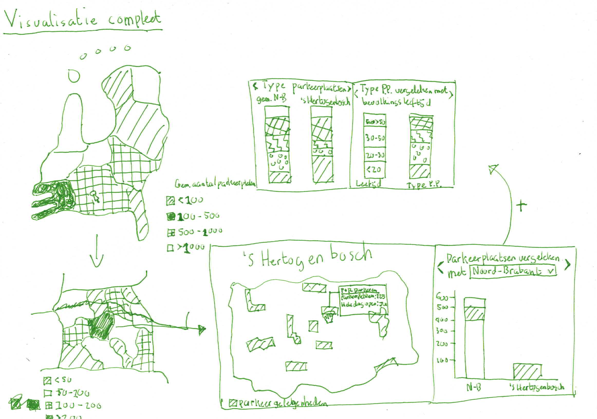

# Auto's in Nederland - Data visualization

Data visualization(s) to gain insight into the impact of cars in cities and municipalities in the Netherlands. Using the D3 library to create a interactive datavisualization(s) comparing cities, municipalities and provinces with the amount and type of parking facilities in the Netherlands.

## Concept

A interactive choropleth map showing the amount of parking facilities in each province and each municipality. When clicking on a municipality, the parking facilities of the parking area's are shown on the map. Hover over a parking facility to see information about the parking facility: price, type of parking facility. Beside the map are multiple datavisualizations showing the amount of parking places of the facility compared with the total in the municipality, the percentages of each type of parking facility in the municipality, and the relation between the amount of parking facilities and the age distribution of a municipality.



## Dependencies

* Express
* D3

See [**`package.json`**](package.json) for more information.

## Data

To make the datavisualisaton I've used several datasets. I combined them together for a complete dataset with overlapping information of the RDW dataset and location data. The data I've gathered come from the following resources:

### RDW

The RDW is the national organization that tracks the registration of vehicles and vehicle related subjects in the Netherlands. The data I used are about organizations of parking places in the Netherlands. The datasets gathered from [RDW.nl](https://opendata.rdw.nl/) are:

* [Open Data Parkeren: GEBIED](https://opendata.rdw.nl/Parkeren/Open-Data-Parkeren-GEBIED/adw6-9hsg)
* [Open Data Parkeren: GEBIEDSBEHEERDER](https://opendata.rdw.nl/Parkeren/Open-Data-Parkeren-GEBIEDSBEHEERDER/2uc2-nnv3)
* [Open Data Parkeren: GEBRUIKSDOEL](https://opendata.rdw.nl/Parkeren/Open-Data-Parkeren-GEBRUIKSDOEL/qidm-7mkf)
* [GEO Parkeer Garages](https://opendata.rdw.nl/Parkeren/GEO-Parkeer-Garages/t5pc-eb34)
* [Open Data Parkeren: GEOMETRIE GEBIED](https://opendata.rdw.nl/Parkeren/Open-Data-Parkeren-GEOMETRIE-GEBIED/nsk3-v9n7)
* [Open Data Parkeren: Index Statisch en Dynamisch](https://opendata.rdw.nl/Parkeren/Open-Data-Parkeren-Index-Statisch-en-Dynamisch/f6v7-gjpa)
* [Open Data Parkeren: PARKING OPEN](https://opendata.rdw.nl/Parkeren/Open-Data-Parkeren-PARKING-OPEN/figd-gux7)
* [Open Data Parkeren: PARKING TOEGANG](https://opendata.rdw.nl/Parkeren/Open-Data-Parkeren-PARKING-TOEGANG/edv8-qiyg)
* [Open Data Parkeren: SPECIFICATIES PARKEERGEBIED](https://opendata.rdw.nl/Parkeren/Open-Data-Parkeren-SPECIFICATIES-PARKEERGEBIED/b3us-f26s)
* [Open Data Parkeren: TARIEFDEEL](https://opendata.rdw.nl/Parkeren/Open-Data-Parkeren-TARIEFDEEL/534e-5vdg)
* [Open Data Parkeren: TIJDVAK](https://opendata.rdw.nl/Parkeren/Open-Data-Parkeren-TIJDVAK/ixf8-gtwq)
* [Open Data Parkeren: PARKEERGEBIED](https://opendata.rdw.nl/Parkeren/Open-Data-Parkeren-PARKEERGEBIED/mz4f-59fw)

### CBS

The CBS is the national organization for collecting information about the dutch society. The data I used is the area layout of the provinces and the municipalities of the Netherlands. The dataset gathered from [CBS](https://www.cbs.nl/) is:

* [CBS gebiedsindelingen](https://www.cbs.nl/nl-nl/dossier/nederland-regionaal/geografische-data/cbs-gebiedsindelingen)

### GeoNames

GeoNames is a website that stores information about geometric map details. The data I've gathered is the complete postal codes data of the Netherlands. The dataset gathered from GeoNames is:

* [GeoNames Data - countries](https://download.geonames.org/export/zip/)

## Install

Clone the repository and navigate to the directory.

**Install dependencies:**

```bash
npm install
```

**Start server**

```bash
npm run start
```

## Features

*Currently no features added.*

## Resources

* [TopoJSON, GeoJSON, and Projections: Developing Interactive Map Visuals for Web Apps - Medium](https://medium.com/better-programming/topojson-geojson-and-projections-developing-interactive-map-visuals-for-web-apps-79e2d50abb19)
* [Converting EPSG projection bounds to a D3.js map - Stackoverflow](https://stackoverflow.com/questions/42259132/converting-epsg-projection-bounds-to-a-d3-js-map)
* [Enter, Update, Exit - Medium](https://medium.com/@c_behrens/enter-update-exit-6cafc6014c36)
* [Thinking with Joins - Mike Bostock](https://bost.ocks.org/mike/join/)
* [Object Constancy - Mike Bostock](https://bost.ocks.org/mike/constancy/)
* [d3 Color Legend](https://observablehq.com/@d3/color-legend)
* [Creating a smooth color legend with an SVG gradient](https://www.visualcinnamon.com/2016/05/smooth-color-legend-d3-svg-gradient)

## License

[Apache-2.0 License](LICENSE)
